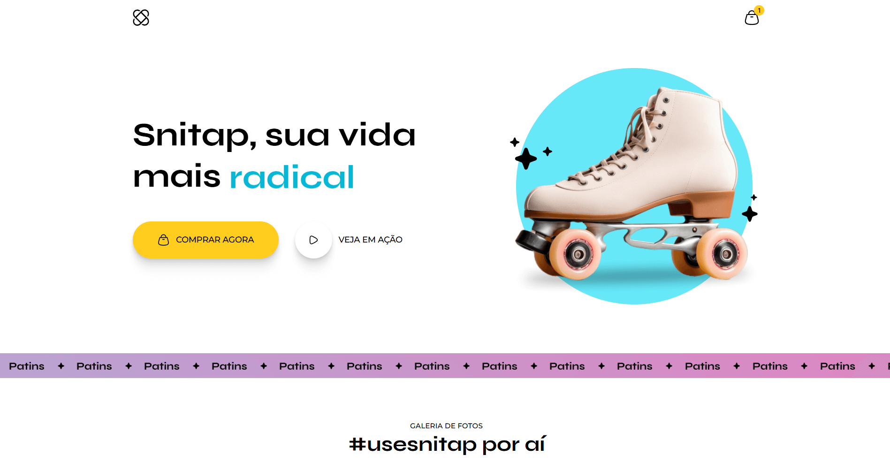

# Snitap


*Preview da landing page do aplicativo Snitap.*

Projeto desenvolvido como parte do curso **Full-Stack da Rocketseat**, com foco no estudo de **HTML5**, **CSS3** e no uso de **CSS Animations e Transitions**, explorando diferentes tipos de animações aplicadas a uma landing page de fotos.


## Tecnologias Utilizadas
- **HTML5**
- **CSS3**


## Objetivo do Projeto
O objetivo deste projeto é praticar a construção de uma **landing page animada** para um aplicativo, aplicando conceitos básicos de **CSS Animations e Transitions**, com foco em fluidez visual, feedback ao usuário e simulação de interações comuns em projetos reais.


## Como visualizar o projeto

### 1. Clone o repositório
```bash
git clone https://github.com/muddyorc/snitap.git
